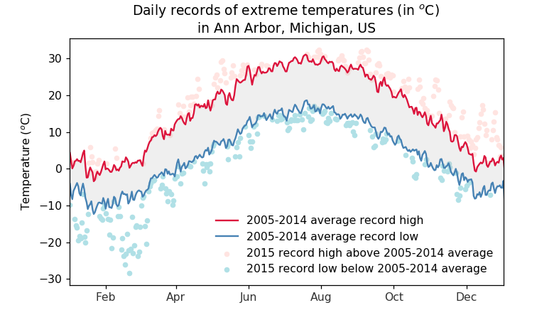
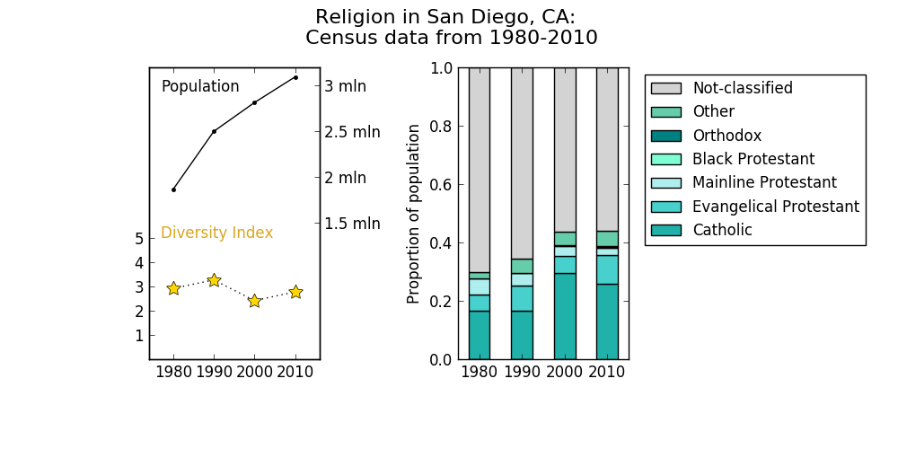

# Matplotlib usage examples

`AnnHarborMI_record_temperatures.ipynb`

`SanDiegoCA_religion_diversity_1980-2010.ipynb`

`RandomData_barplot_interactive.ipynb`
> Interactive bar plot when used in the Jupyter Notebook
